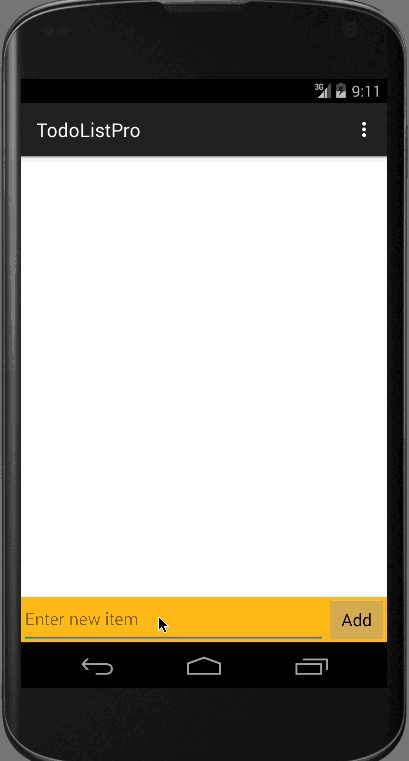

# TodoListPro

This is a Android demo application called "TodoListPro" that can be used to track some todo items

Time spent: 4 hours spent in total

Features:
---------
Supports adding new items, editing and deleting existing items.
Supports Save/Cancel in the edit mode.
Persists the changes in the local file.

Help operations:
-------------------
Add new item = enter new item in the Text box and click on add button.
Delete item = long press on the item.
Edit item = single press on the item.

GIF created with [LiceCap](http://www.cockos.com/licecap/).

